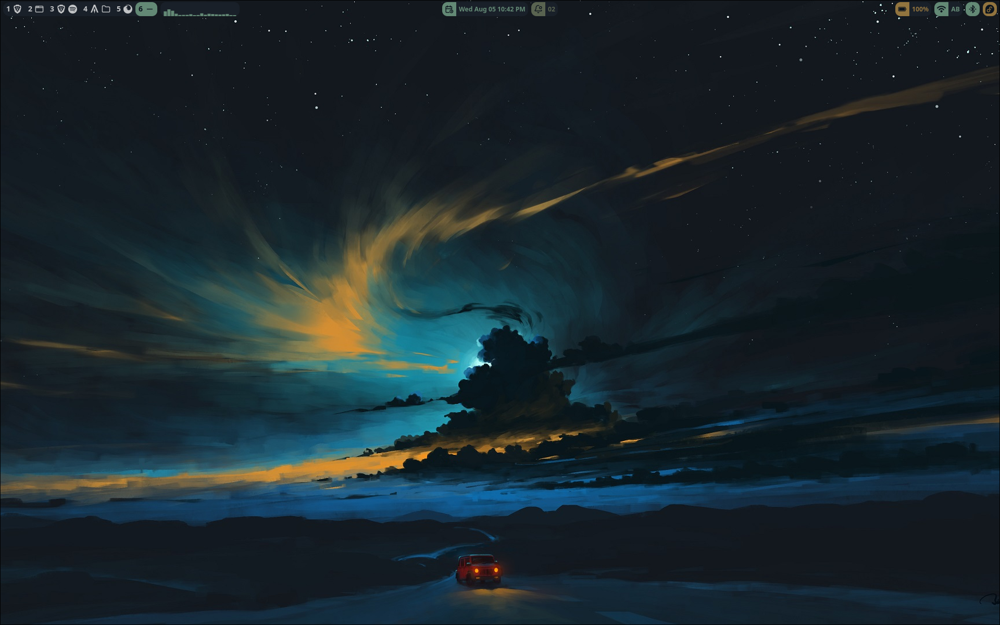
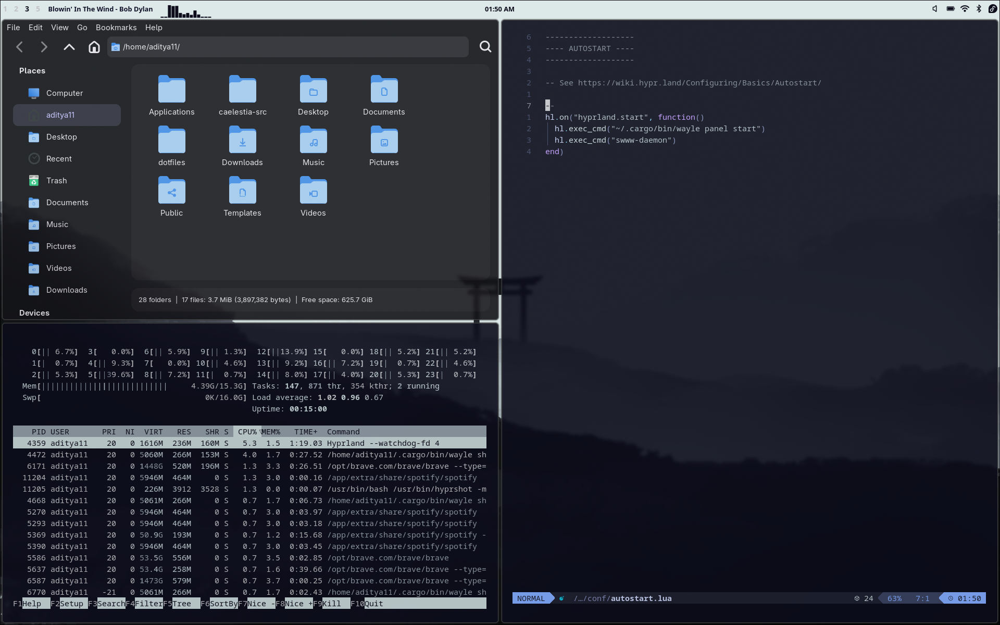

# 🚀 Hyprland Dotfiles

Just the way I like it.

---

# 📸 Demo

## Desktop



## Hyprland



---

 

# 🛠️ Applications Used

| Tool          | Purpose                        |
| ------------- | ------------------------------ |
| 🪟 Hyprland   | Wayland compositor             |
| 📊 Wayle      | Top bar / status bar           |
| 🚀 Fuzzel     | Application launcher           |
| 🖥️ Alacritty | Terminal emulator              |
| 📂 Nautilus   | File manager                   |
| 🎨 Pywal      | Generate colors from wallpaper |
| ⭐ Starship    | Cross-shell prompt             |
| 🐚 Bash       | Shell                          |
| 🌈 Hyfetch    | System information             |
| 🎭 GTK        | GTK3/GTK4 theming              |

---

# 📁 Repository Structure

```text
.
├── demo/
│   ├── desktop.png
│   └── hyprland.png
├── hypr/
├── fuzzel/
├── alacritty/
├── wayle/
├── wal/
├── gtk-3.0/
├── gtk-4.0/
├── gtkrc
├── gtkrc-2.0
├── hyfetch.json
├── mimeapps.list
├── starship.toml
├── .bashrc
├── install.sh
├── sync.sh
└── README.md
```

---

# 🚀 Installation

## 1. Clone the repository

```bash
git clone https://github.com/<your-github-username>/dotfiles.git
cd dotfiles
```

## 2. Make the scripts executable

```bash
chmod +x install.sh sync.sh
```

## 3. Install the dotfiles

```bash
./install.sh
```

The installer will:

* 📦 Back up your existing configuration
* 📂 Copy all configuration files into the correct locations
* 🐚 Install the included `.bashrc`
* 🎨 Restore GTK and Pywal configuration

---

# 🔄 Updating the Repository

Whenever you make changes to your configuration, synchronize them back into the repository:

```bash
./sync.sh
```

Then commit and push:

```bash
git add .
git commit -m "Update dotfiles"
git push
```

---

# 📦 Recommended Packages

## Fedora

```bash
sudo dnf install \
hyprland \
fuzzel \
alacritty \
nautilus \
hyfetch \
python3-pywal \
starship
```

## CachyOS / Arch Linux

```bash
sudo pacman -S \
hyprland \
fuzzel \
alacritty \
nautilus \
hyfetch \
python-pywal \
starship
```

---

# ⌨️ Default Workflow

| Shortcut          | Action                                                    |
| ----------------- | --------------------------------------------------------- |
| **Super + Enter** | Open Alacritty                                            |
| **Super + Space** | Launch Fuzzel                                             |
| **Wayle**         | Display top bar with workspaces, clock, and system status |
| **Pywal**         | Generate a color scheme from the current wallpaper        |
| **Starship**      | Enhance the Bash prompt                                   |

---

 

